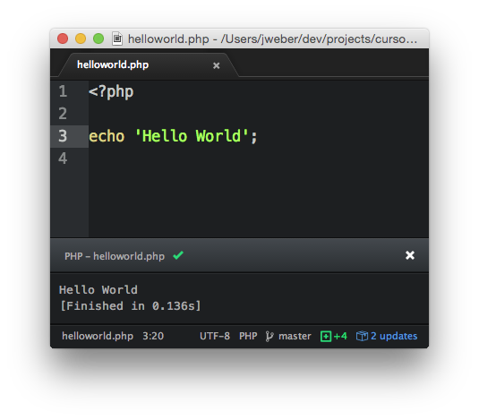

> # Work In Progress
> ## Pull Requests são sempre bem vindos!

# Curso PHP: Começando do jeito certo!
Guia de estudo do curso gratuito de PHP organizado em parceria com a Universidade Salvador.

## Objetivo
Ensinar a linguagem PHP de modo que os estudantes aprimorem suas habilidades na área e assim ao concluírem o curso possuam conhecimento amplo das noções básicas do mesmo, permitindo que os mesmos participem e/ou desenvolvam projetos que envolvam a referida linguagem, assim como, em outras atividades relacionadas à programação. O objetivo geral é, portanto, preparar os alunos na teoria e na prática para que programem do "jeito certo".
A fim de alcançar tais objetivos, torna-se necessário identificar os objetivos específicos. Estes seriam:
* Oportunizar aos participantes os conhecimentos sobre o desenvolvimento Web, utilizando da linguagem PHP, em sua versão mais recente.
* Oferecer condições ao participante de aperfeiçoar suas habilidades por meio da criação de aplicações simplificadas e práticas.
* Fortalecer o uso das boas práticas durante a programação.

## Público Alvo
* Desenvolvedores
* Analistas de Sistemas
* Engenheiros de Software
* Gerentes de Projeto
* Estudantes

## Custo
> Apenas 02 kg de alimentos POR AULA

## Local
Rua Rio Tinto, 152, Santa Mônica, Feira de Santana - Ba. CEP 44050-250.

## Data e Horário
- Início: 22/08/2015
- Término: 10/10/2015 (previsto)
- Horário: 13h00 às 17h00 (4h/sábado)
- Carga Horária: 30h

## Conteúdo (WIP)
Introdução ao PHP
* O que é?
* Como Surgiu?
* Alguns projetos

Preparando o ambiente
* Instalando PHP 5.5 / 5.6
* Utilizando o Servidor Embutido
* SublimeText

Paradigmas de Desenvolvimento
* Programação Orientada a Objetos
* Programação Funcional

PHP Básico
* Tipos Primitivos / Variáveis
* Operadores de Comparação
* Argumentos Condicionais
* Switch / For / Foreach
* Trabalhando com Strings
* Operador Ternário
* Arrays

PHP Orientado a Objetos
* Pensamento Orientado a Objetos
* Primeiros Princípios
* Classes vs Objetos
* Criando classes
* Atributos, Métodos e Assinaturas
* Estendendo classes
* Namespaces
* Modificadores de acesso
* Polimorfismo
* Encapsulamento
* Criando e entendendo interfaces
* Criando classes e métodos abstratos
* Traits

PSRs (1, 2, 3 e 4)
* O que são e para que servem?

Gerenciamento de Dependências
* O que são dependências?
* Trabalhando com Composer e Packagist
* Instalando
* Entendendo o Composer.json
* Baixando dependências
* Entendendo o autoloader
* Composer.lock
* Falando sobre o Packagist
* Submetendo um pacote

Trabalhando com PHP em linha de comando
* O que muda na prática?
* O que consigo fazer
* Criando rotinas

PHP Standard Library (SPL)
* O que é SPL
* Trabalhando com Iterators
* Interfaces
* Exceptions
* Funções
* Classes e Interfaces

Falando sobre banco de dados
* Classes nativas
* MySQL vs MySQLi
* Classe PDO

Caching
* O que é caching?
* Vantagens
* Bytecode cache
* Object cache

Segurança
* Data Filtering
* Sanatization
* SQL Injection

Testes automatizados
* O que são testes?
* Vantagens
* Falando sobre TDD
* Tipos de testes
* Unitários / Aceitação

PHPUnit
* Instalando
* Primeiros passos
* setUp e TearDown
* Criano nosso primeiro teste
* Rodando testes
* Configurando bootstrap
* Cobertura de código

# Introdução ao PHP
## O que é PHP?
O PHP (um acrônimo recursivo para PHP: Hypertext Preprocessor) é uma linguagem de script [open source](http://git.php.net/) de uso geral, muito utilizada, e especialmente adequada para o desenvolvimento web e que pode ser embutida dentro do HTML.

Por exemplo:

```php
<!DOCTYPE HTML PUBLIC "-//W3C//DTD HTML 4.01 Transitional//EN"
    "http://www.w3.org/TR/html4/loose.dtd">
<html>
    <head>
        <title>Exemplo</title>
    </head>
    <body>

        <?php
        echo "Olá, eu sou um script PHP!";
        ?>

    </body>
</html>
```

O código PHP é delimitado pelas [instruções de processamento (tags) de início e fim ```<?php``` e ```?>```](http://php.net/manual/en/language.basic-syntax.phpmode.php) que permitem que você pule para dentro e para forma do "modo PHP".

## História
Criado em 1994 por [Rasmus Lerdof](https://pt.wikipedia.org/wiki/Rasmus_Lerdorf), a primeira encarnação do PHP foi um simples conjunto de binários Common Gateway Interface (CGI) escrito em linguagem de programação C.

Originalmente usado para acompanhamento de visitas para seu currículo online, ele nomeou o conjunto de scripts de "Personal Home Page Tools" mais frequentemente referenciado como "PHP Tools." Ao longo do tempo, mais funcionalidades foram desejadas, e Rasmus reescreveu o PHP Tools, produzindo uma maior e rica implementação.

Em Junho de 1995, Rasmus [liberou](https://groups.google.com/forum/#!msg/comp.infosystems.www.authoring.cgi/PyJ25gZ6z7A/M9FkTUVDfcwJ) o código fonte do PHP Tools para o público, o que permitiu que desenvolvedores usassem da forma como desejassem. Isso permitiu - e encorajou - usuários a fornecerem correções para bugs no código, e em geral, aperfeiçoá-lo.

Leia mais:
* [História do PHP (PT BR)](http://php.net/manual/pt_BR/history.php.php)
* [PHP Museum](http://museum.php.net/)
* [Video: PHP Development History 2014](https://www.youtube.com/watch?v=ULjUgdxNaHg)

## Popularidade

O PHP sempre foi muito popular entre as [linguagens de programação server-side](https://pt.wikipedia.org/wiki/Linguagem_server-side), hoje, 81% das páginas web utilizam PHP ([w3techs](http://w3techs.com/)). Os websites mais famosos são:

1. Facebook (tem sua própria versão do PHP, chamada de [HHVM](http://hhvm.com/))
2. Wikipedia
3. Baidu
4. Yahoo!
5. Tumblr
6. Flickr
7. Wordpress
8. Mailchimp
9. LAD Bible
10. Birchbox
11. SeatGeek
12. Fotolia
13. Flipkart
14. Digg
15. iStockPhoto

> Fonte: [What are the top 10 websites built with PHP?](http://www.quora.com/What-are-the-top-10-websites-built-with-PHP)

# Preparando o Ambiente

Sempre utilize a última versão estável do PHP por causa do grande número de features e correções que foram adicionados ao longo dos anos. Atualmente estamos na versão [PHP 5.6](http://php.net/downloads.php).

## Instalando no Windows
Faça o download dos arquivos binários (.zip) [nessa página](http://windows.php.net/download/) e descompacte-os na pasta ```c:\php56``` do seu computador. Verifique se nessa pasta existe o arquivo ```c:\php56\php.exe```. Agora, vamos adicionar o PHP à variável de ambiente [PATH](http://www.windows-commandline.com/set-path-command-line/). Digite no [Prompt de Comando](https://pt.wikipedia.org/wiki/Prompt_de_comando) (ou CMD) o comando abaixo e pressione ```ENTER```:

```shell
setx path "%path%;c:\php56"
```

Se você não tem muito domínio com a linha de comando, dê uma olhada [nesse tutorial](https://www.java.com/pt_BR/download/help/path.xml), pois ele mostra como adicionar um caminho à variável de ambiente PATH.

## Instalando no Linux

A melhor maneira de instalar o PHP numa distribuição Linux baseada em Unix é utilizando um [geranciador de pacotes](https://en.wikipedia.org/wiki/List_of_software_package_management_systems#Linux_distributions). Isso vai depender da sua distribuição Linux na qual você está utilizando. No Ubuntu, uma das distribuições mais populares, você irá instalar através do gerenciador de pacote ```apt```. Apenas digite o comando abaixo e [verifique se foi instalado corretamente](#verificando-a-instalação).

```shell
$ sudo apt-get install php5-cli
```
> Não incluir o sinal de cifrão/dollar no comando.


## Instalando no Mac OSX

No sistema operacional Macintosh, o PHP já vem pré-instalado, na maioria das vezes na versão ```5.4```. Antes de instalar, [verifique se você já possui o PHP instalado](#verificando-a-instalação). Se não, a melhor maneira de instalar no Mac OSX é utilizando o gerenciador de pacotes chamado ```Homebrew``` (ou apenas ```Brew```).

> [Site do Homebrew](http://brew.sh/)

Um vez que o ```Homebrew``` foi instalado corretamente, basta digitar o comando a seguir:

```shell
$ brew install php55
```

Agora, verifique se o PHP foi instalado corratamente no [tópico](#verificando-a-instalação) a seguir.

## Verificando a instalação

Para saber se o PHP está instalado corretamente no seu sistema operacional, digite ```php -v``` no CMD (ou Shell, para usuários Linux) e verifique se você obtém uma resposta parecida com essa:

```shell
$ php -v
PHP 5.6.4 (cli) (built: Dec 24 2014 12:05:33)
Copyright (c) 1997-2014 The PHP Group
Zend Engine v2.6.0, Copyright (c) 1998-2014 Zend Technologies
    with Zend OPcache v7.0.4-dev, Copyright (c) 1999-2014, by Zend Technologies
    with Xdebug v2.2.5, Copyright (c) 2002-2014, by Derick Rethans
```

> Não incluir o sinal cifrão/dollar no comando. Esse comando é utilizado para mostrar a versão PHP instalada no seu sistema operacional.

Leia mais:
* [O que significa thread safety quando estou fazendo o download do PHP?](http://php.net/manual/pt_BR/faq.obtaining.php#faq.obtaining.threadsafety)
* [eBook - PHP Pandas - Installation](http://daylerees.com/php-pandas-installation/)
* [PHP The Right Way - Getting Started](http://www.phptherightway.com/#getting_started)

## Editores de Texto

Durante o nosso curso, utilizaremos o [Atom.io](https://atom.io/) como editor de texto para criar nossos scripts PHP. Ele é um editor open source e foi desenvolvido pela equipe do [Github](https://github.com/). Faça [aqui](https://atom.io/) o download do binário e instale no seu computador de acordo com o seu sistema operacional.


## Hello, World

Uma vez que nosso [ambiente de desenvolvimento está preparado](#preparando-o-ambiente), iremos executar nosso primeiro script PHP. Existem diversas maneiras de executá-lo, uma delas é via Terminal (ou CMD, no caso do Windows), digite o comando abaixo:

```shell
$ php -r 'echo "Hello World";'
```
> php -r 'code' (Roda um código PHP sem as scripts tags <?php..?>)

Outra maneira, é criando um arquivo ```helloworld.php``` com o seguinte conteúdo:

```php
<?php

echo "Hello World";
```
Para executar esse script no Terminal, digite:

```shell
$ php -f helloworld.php
```

Também é possível executar scripts PHP diretamente do Atom.io, abra o arquivo ```helloworld.php``` no editor e pressione ```ctrl-shift-b```(ou ```cmd-i```, no OSX).

Abrirá uma caixa com o output do script, dessa maneira:



## Servidor Web

A maneira mais popular de executar os scripts PHP é junto com um servidor web, como [Apache](http://www.apache.org/), [Nginx](http://nginx.org/) ou [Lighttpd](http://www.lighttpd.net/). Mas, o que muitas pessoas não sabem é que o PHP, desde a sua versão ```5.4```, já traz um [servidor web embutido](http://php.net/manual/pt_BR/features.commandline.webserver.php).

Para utilizá-lo, basta digitar o seguinte comando:

```shell
$ php -S localhost:9000
```
Dessa maneira, o PHP irá levantar um servidor web na porta ```9000``` e específicar a pasta atual como o seu [```docroot```](http://www.karelia.com/support/sandvox/help/z/Document_Root.html).

Veja o output abaixo e observe o atual ```Document Root```:

```shell
PHP 5.4.17 Development Server started at Mon Aug 17 16:08:21 2015
Listening on http://localhost:9000
Document root is /Users/jweber/dev/projects/curso-php-free
Press Ctrl-C to quit.
```
Se você quiser forçar um outro caminho como ```docroot```, acrescente ao comando anterior o atributo ```-t```, ficando dessa maneira:

```shell
$ php -S localhost:9000 -t c:\www
```

Agora o output será algo parecido com isso:

```shell
PHP 5.4.17 Development Server started at Mon Aug 17 16:08:21 2015
Listening on http://localhost:9000
Document root is c:\www
Press Ctrl-C to quit.
```

Abra esse link [http://localhost:9000/helloworld.php](http://localhost:9000/exemplos/helloworld.php) no seu navegador e veja o resultado do seu script. Se não, você receberá uma mensagem ```HTTP 404 (page not found)```.

> Lembre-se que o arquivo ```helloworld.php``` deverá estar dentro da pasta ```docroot```, por exemplo: ```c:\www\helloworld.php```

Parabéns! Você acaba de executar seu primeiro script PHP :)

# PHP Básico
Uma vez que estamos aptos a executar os scripts PHP, tanto via CLI (Command-Line Interface) quanto via Servidor Web, a partir de agora daremos início aos estudos de sintaxe básica da linguagem PHP.

## Variáveis
Em PHP, variáveis são palavras que começam com um símbolo de dólar ```$```. Vejamos um exemplo:

```php
<?php

$variavel = 'Hello, World';
$variavel = 3;
$variavel = 1.4;
$variavel = false;
$variavel = 50 == '50'; // true
$variavel = 50 === '50' // false
$variavel = null;
```

PHP é uma [linguagem fracamente tipada](https://pt.wikipedia.org/wiki/Linguagem_tipada), então, você não específica o tipo da variável, apenas atribui um valor à ela. As linguagens com essa característica permitem que você altere os tipos de dados contido em uma variável durante a execução do programa.

O PHP suporta oito [tipos primitivos](http://php.net/manual/pt_BR/language.types.intro.php): ```String```, ```Integer```, ```Boolean```, ```Float```, ```Array```, ```Object```, ```Resource``` e ```NULL```.

## Strings

* Aspas Simples

```php
<?php

echo 'Essa é uma string simples';

echo 'Além disso, você pode embarcar novas linhas
nas strings, esse é um caminho
legal de fazer';

// Arnold once said: "I'll be back"
echo 'Arnold once said: "I\'ll be back"';

// Isso não vai criar \n uma nova linha
echo 'Isso não vai criar \n uma nova linha';

$variavel = 'com';
// Variáveis não funcionam $variavel com as simples
echo 'Variáveis não funcionam $variavel com aspas simples';
```

* Aspas Duplas

```php
<?php

$variavel = 'Legal';
// Variáveis funcionam assim: Legal
echo "Variáveis funcionam assim: $variavel";
```

## Operadores de String
Possibilita concatenar ou juntar strings. Em algumas linguagens o sinal de ```+``` faz esse papel, mas no PHP ele foi subtituído pelo ```ponto```.

**Exemplo - Concatenação de Strings**
```php
<?php
$a = "Hello ";
$b = $a . "World!"; // Agora $b contém a string "Hello World!"

$a = "Hello ";
$a .= "World!";     // Agora $a contém a string "Hello World!"
?>
```

Leia mais:
* [php.net - String Operators](http://php.net/manual/en/language.operators.string.php)
* [Why is the php string concatenation operator a dot (.)?](http://stackoverflow.com/questions/4266799/why-is-the-php-string-concatenation-operator-a-dot)

## Integers
Um ```integer``` é um número que está contido nesse intervalo ```Z = {..., -2, -1, 0, 1, 2, ...}```. E eles podem ser representados em decimal (base 10), hexadecimal (base 16), octal (base 8) ou binário (base 2). Os sinais de ```-``` ou ```+``` são opcionais.

Tipo        | Notação
----------- | -------
Octal       | Número começa com ```0``` (zero)
Hexadecimal | Número começa com 0x
Binário     | Número começa com 0b

> Binários literais inteiros estão disponíveis desde o ```PHP 5.4```.

**Exemplo - Literais Inteiros**
```php
<?php
$a = 1234; // decimal number
$a = -123; // a negative number
$a = 0123; // octal number (equivalent to 83 decimal)
$a = 0x1A; // hexadecimal number (equivalent to 26 decimal)
$a = 0b11111111; // binary number (equivalent to 255 decimal)
?>
```

Leia mais:
* [php.net - Integers](http://php.net/manual/en/language.types.integer.php)
* [php.net - String conversion to numbers](http://php.net/manual/en/language.types.string.php#language.types.string.conversion)

## Floating point numbers
Números de ponto flutuante (também conhecidos como ```floats```, ```doubles``` ou ```real numbers```) podem ser escritos seguindo diversas sintaxes:

```php
<?php
$a = 1.234;
$b = 1.2e3; // 1200
$c = 7E-10;
```

Leia mais:
* [php.net - Floating point numbers](http://php.net/manual/en/language.types.float.php)

## Booleans
Um ```boolean``` representa o "valor da verdade" e pode ser ```TRUE``` ou ```FALSE```. Para representá-lo, utilize as constantes **TRUE** ou **FALSE**. Ambas não são case-sensitive, ou seja, não importa se está em caixa alta ou baixa (```True``` é igual a ```TRUE``` que é igual a ```true```).

**Exemplo**
```php
<?php
$foo = false; // assign the value FALSE to $foo

$foo = (50 == '50') // assign the value TRUE to $foo
$foo = (50 != '50') // assign the value FALSE to $foo

$foo = (50 !== '50') // assign the value TRUE to $foo
$foo = (50 === '50') // assign the value FALSE to $foo
```

## NULL
O valor especial **NULL** representa uma variável "sem valor".

Uma variável é considerado ```null``` quando:
* Atribui a constante ```NULL```;
* Não atribuiu valor algum ainda;
* Usando a função [unset()](http://php.net/manual/en/function.unset.php);

```php
<?php
$var = NULL;

$texto = 'Foo Bar'; // $texto é uma string
unset($texto); // $texto é NULL
?>
```
> Dê uma olhada nas funções [is_null()](http://php.net/manual/en/function.is-null.php) e [unset()](http://php.net/manual/en/function.unset.php).

## Arrays
Um array no PHP é atualmente um mapa ordenado. Um mapa é um tipo que relaciona valores para chaves. Este tipo é otimizado de várias maneiras, então você pode usá-lo como um array real, ou uma lista (vetor), hashtable (que é uma implementação de mapa), dicionário, coleção, pilha, fila e provavelmente mais. Como você pode ter outro array PHP como um valor, você pode facilmente simular árvores.

**Sintaxe**
```
array(
    chave  => valor,
    chave2 => valor2,
    chave3 => valor3,
    ...
)
```

**Exemplo - Array Simples**
```php
<?php

$lista = array('Foo', 'Bar', 'Fizz', 'Buzz');

$lista = ['Foo', 'Bar', 'Fizz', 'Buzz']; // php >= 5.4
$numeros = [10, "vinte", 30, 40.8, false, null]; // php >= 5.4

var_dump($numeros);

/*
array(6) {
  [0]=>
  int(10)
  [1]=>
  string(5) "vinte"
  [2]=>
  int(30)
  [3]=>
  float(40.8)
  [4]=>
  bool(false)
  [5]=>
  NULL
}
*/
```

A ```chave``` pode ser tanto um integer ou uma string. Se a ```chave``` é uma representação padrão de um integer, ele será interpretado assim (por exemplo, "8" será interpretado como 8, enquanto "08" será interpretado como "08"). Os índices do tipo ```float``` serão truncados para ```integer```. Não há diferença entre arrays indexados e associativos em PHP, apenas um tipo de array, que pode ter índices do tipo ```integer``` ou ```string```.

**Exemplo - Chaves como String**

```php
<?php

$variavel = array(
  "foo" => "bar",
  "bar" => "foo",
);

// as of PHP 5.4
$variavel = [
  "foo" => "bar",
  "bar" => "foo",
];

```

**Exemplo - Acessando Valores de um Array**
```php
<?php

$variavel = array(
  "somearray" => array(
    6 => 5,
    13 => 9,
    "a" => 42
  )
);

echo $variavel["somearray"][6];    // 5
echo $variavel["somearray"][13];   // 9
echo $variavel["somearray"]["a"];  // 42
```

**Exemplo - Type Casting and Overwriting**
```php
<?php
$array = array(
    1    => "a",
    "1"  => "b",
    1.5  => "c",
    true => "d",
);
var_dump($array);

/*
array(1) {
  [1]=>
  string(1) "d"
}
*/
?>
```

**Exemplo - Mixed integer and string keys**
```php
<?php
$array = array(
    "foo" => "bar",
    "bar" => "foo",
    100   => -100,
    -100  => 100,
);
var_dump($array);

/*
array(4) {
  ["foo"]=>
  string(3) "bar"
  ["bar"]=>
  string(3) "foo"
  [100]=>
  int(-100)
  [-100]=>
  int(100)
}
*/
?>
```

Leia mais:
* [php.net - Arrays](http://php.net/manual/pt_BR/language.types.array.php)

## Manipulando Arrays
Você pode também modificar um array existente explicitamente assimilando valores nele.

Isto é feito apenas assimilando valores para o array enquanto especificando a chave em colchetes. Você pode omitir a chave, colocando um par vazio de colchetes ("[]").

```
$arr[chave] = valor;
$arr[] = valor;
// chave tanto um [integer](http://php.net/manual/pt_BR/language.types.integer.php) ou [string](http://php.net/manual/pt_BR/language.types.string.php)
// valor pode ser qualquer coisa
```

```php
<?php
$arr = array(5 => 1, 12 => 2);

$arr[] = 56;    // Isto é o mesmo que $arr[13] = 56;
                // nesse ponto do script

$arr["x"] = 42; // Isto acrescenta um novo elemento
                // para o array com a chave "x"

unset($arr[5]); // Isto remove um elemento do array

unset($arr);    // E isto apaga todo o array
?>
```

Leia mais:
* [php.net - Arrays](http://php.net/manual/pt_BR/language.types.array.php)

## Operadores de Comparação
Operadores de comparação, como os seus nomes implicam, permitem que você compare dois valores. Você pode se interessar em ver as [tabelas de comparação de tipos](http://php.net/manual/pt_BR/types.comparisons.php), que tem exemplo das várias comparações entre tipos relacionadas.

Exemplo	  | Nome           | Resultado
--------- | -------------- | ----------
$a == $b  | Igual          | Verdadeiro (TRUE) se $a é igual a $b.
$a === $b | Idêntico       | Verdadeiro (TRUE) se $a é igual a $b, e eles são do mesmo tipo (introduzido no PHP4).
$a != $b  | Diferente      | Verdadeiro se $a não é igual a $b.
$a <> $b  | Diferente      | Verdadeiro se $a não é igual a $b.
$a !== $b	| Não idêntico   | Verdadeiro de $a não é igual a $b, ou eles não são do mesmo tipo (introduzido no PHP4).
$a < $b	  | Menor que      | Verdadeiro se $a é estritamente menor que $b.
$a > $b	  | Maior que      | Verdadeiro se $a é estritamente maior que $b.
$a <= $b  | Menor ou igual | Verdadeiro se $a é menor ou igual a $b.
$a >= $b	| Maior ou igual | Verdadeiro se $a é maior ou igual a $b.

Se você comparar um inteiro com uma string, a string é [convertida para um número](http://php.net/manual/pt_BR/language.types.string.php#language.types.string.conversion). Se você comparar 2 strings numéricas, elas serão comparadas como inteiras. Estas regras também se aplicam ao comando switch.

```php
<?php
var_dump(0 == "a"); // 0 == 0 -> true
var_dump("1" == "01"); // 1 == 1 -> true
var_dump("1" == "1e0"); // 1 == 1 -> true

switch ("a") {
  case 0:
      echo "0";
      break;
  case "a": // nunca é alcançado porque "a" já foi combinado com 0
      echo "a";
      break;
}
?>
```

Leia mais:
* [php.net - Operadores de Comparação](http://php.net/manual/pt_BR/language.operators.comparison.php)

## Operadores de Incremento/Decremento
O PHP suporta operadores de pré e pós-incremento e decremento no estilo C.

Exemplo |	Nome            | Efeito
------- | --------------- | -------
++$a    | Pré-incremento	| Incrementa $a em um, e então retorna $a.
$a++    | Pós-incremento	| Retorna $a, e então incrementa $a em um.
--$a    | Pré-decremento	| Decrementa $a em um, e então retorna $a.
$a--    | Pós-decremento	| Retorna $a, e então decrementa $a em um.

Leia mais:
* [php.net – Operadores de Incremento/Decremento](http://php.net/manual/pt_BR/language.operators.increment.php)

## Outros Operadores
* [Operadores de Atribuição](http://php.net/manual/pt_BR/language.operators.assignment.php)
* [Operador Bit-a-bit](http://php.net/manual/pt_BR/language.operators.bitwise.php)
* [Operadores de controle de erro](http://php.net/manual/pt_BR/language.operators.errorcontrol.php)
* [Operadores de Execução](http://php.net/manual/pt_BR/language.operators.execution.php)

## Constantes
Uma constante é um identificador (nome) para um único valor. Como o nome sugere, esse valor não pode mudar durante a execução do script (exceção às [constantes mágicas](http://php.net/manual/pt_BR/language.constants.predefined.php), que não são constantes de verdade). As constantes são "case sensitive" (sensível ao tamanho de letras) por padrão. Por convenção, identificadores de constantes são sempre em maiúsculas.

**Exemplo - Constantes válidas e inválidas**
```php
<?php

// Valid constant names
define("FOO",     "something");
define("FOO2",    "something else");
define("FOO_BAR", "something more");

// Invalid constant names
define("2FOO",    "something");

// This is valid, but should be avoided:
// PHP may one day provide a magical constant
// that will break your script
define("__FOO__", "something");

?>
```

Leia mais:
* [php.net - Constantes](http://php.net/manual/pt_BR/language.constants.php)

## Operadores Aritméticos

Exemplo |	Nome          | Resultado
------- | ------------- | ---------
-$a	    | Negação	      | Oposto de $a.
$a + $b	| Adição        |	Soma de $a e $b.
$a - $b	| Subtração     |	Diferença entre $a e $b.
$a * $b	| Multiplicação |	Produto de $a e $b.
$a / $b	| Divisão	      | Quociente de $a por $b.
$a % $b	| Módulo	      | Resto de $a dividido por $b.

> O operador de divisão ```/``` sempre retorna um valor ponto flutuante, a não ser que os dois operadores sejam inteiros

O PHP possui inúmeras [funções matemáticas](http://php.net/manual/pt_BR/ref.math.php), como por exemplo:

```php
<?php
print pi();        // 3.1415926535898 "Valor de PI"
print ceil(5.4);   // 6 "Arredonda para cima"
print hypot(3, 4); // 5 "Calcula a Hipotenusa"
print max([50, 550, 40, 45, 44]); // 550 "Encontra o valor máximo"
```

Leia mais:
* [php.net - Operadores Aritméticos](http://php.net/manual/pt_BR/language.operators.arithmetic.php)
* [php.net - Funções matemáticas](http://php.net/manual/pt_BR/ref.math.php)

## Operadores Lógicos

Exemplo   |	Nome  | Resultado
--------- | ----- | ---------
$a and $b	| E	    | Verdadeiro (**TRUE**) se tanto $a quanto $b são verdadeiros.
$a or $b	| OU    |	Verdadeiro se $a ou $b são verdadeiros.
$a xor $b |	XOR   |	Verdadeiro se $a ou $b são verdadeiros, mas não ambos.
! $a	    | NÃO	  | Verdadeiro se $a não é verdadeiro.
$a && $b	| E	    | Verdadeiro se tanto $a quanto $b são verdadeiros.
$a || $b	| OU	  | Verdadeiro se $a ou $b são verdadeiros.

Leia mais:
* [php.net - Operadores Lógicos](http://php.net/manual/pt_BR/language.operators.logical.php)
* [php.net - Precedência de Operadores](http://php.net/manual/pt_BR/language.operators.precedence.php)

## Estruturas de controle
Qualquer script PHP é construído por uma série de instruções. Uma instrução pode ser uma atribuição, uma chamada de função, um 'loop', uma instrução condicional, ou mesmo uma instrução que não faz nada (um comando vazio). Instruções geralmente terminam com um ponto e vírgula. Além disso, as instruções podem ser agrupados em um grupo de comandos através do encapsulamento de um grupo de comandos com chaves. Um grupo de comandos é uma instrução também.

Essa é uma lista das estruturas de controle no PHP:

* if
* else
* elseif/else if
* while
* do-while
* for
* foreach
* break
* continue
* switch
* return
* require
* include
* require_once
* include_once
* goto

Informações sobre cada uma delas podem ser encontradas [nessa página](http://php.net/manual/pt_BR/language.control-structures.php).

## If Else

```php
<?php
if ($a > $b)
  echo "a is bigger than b";
?>
```
> As chaves ```{}``` não são obrigatórias quando a instrução possui apenas uma linha

```php
<?php
if ($a > $b) {
  echo "a is bigger than b";
  $b = $a;
}
?>
```
**Exemplo - Else**
```php
<?php
if ($a > $b) {
  echo "a is greater than b";
} else {
  echo "a is NOT greater than b";
}
?>
```
> A instrução ```else``` só é executada se a expressão de condição do ```if``` for FALSE, e se tiver qualquer expressão elseif - somente se eles também retornarem FALSE.

**Exemplo - Elseif**
```php
<?php
if ($a > $b) {
    echo "a is bigger than b";
} elseif ($a == $b) {
    echo "a is equal to b";
} else {
    echo "a is smaller than b";
}
?>
```

Leia mais:
* [php.net - if](http://php.net/manual/pt_BR/control-structures.if.php)
* [php.net - else](http://php.net/manual/pt_BR/control-structures.else.php)
* [php.net - elseif/else if](http://php.net/manual/pt_BR/control-structures.elseif.php)

## For
O loop for é o loop mais complexo no PHP. Ele tem comportamento semelhante ao C. A sintaxe do loop for é:

```
for (expr1; expr2; expr3)
    statement
```

Analise os seguintes exemplos. Todos exibem números de 1 até 10:
```php
<?php
/* exemplo 1 */

for ($i = 1; $i <= 10; $i++) {
  echo $i;
}

/* exemplo 2 2 */

for ($i = 1; ; $i++) {
  if ($i > 10) {
      break;
  }
  echo $i;
}

/* exemplo 3 */

$i = 1;
for (; ; ) {
  if ($i > 10) {
      break;
  }
  echo $i;
  $i++;
}

/* exemplo 4 */

for ($i = 1, $j = 0; $i <= 10; $j += $i, print $i, $i++);
?>
```

É comum para muitos usuários iterar em arrays como no exemplo abaixo.
```php
<?php
/*
 * Esta é uma array com alguns dados que devem ser modificados
 * durante a execuçao do loop for.
 */
$people = array(
  array('name' => 'Kalle', 'salt' => 856412),
  array('name' => 'Pierre', 'salt' => 215863)
);

for($i = 0; $i < count($people); ++$i) {
  $people[$i]['salt'] = mt_rand(000000, 999999);
}
?>
```

O PHP também suporta a sintaxe alternativa "dois pontos" para o loop for.
```
for (expr1; expr2; expr3):
    statement
    ...
endfor;
```
Leia mais:
* [php.net - For](http://php.net/manual/pt_BR/control-structures.for.php)

## Foreach
O ```foreach```permite interar arrays e objetos de uma maneira muito simples. Existem duas formas de utilizá-lo:

```
foreach (array_expression as $value)
    statement
```
```
foreach (array_expression as $key => $value)
    statement
```

**Exemplo - Foreach**
```php
<?php
$arr = array(1, 2, 3, 4);
foreach ($arr as $value) {
  echo $value;
}

/*
Output
1234
*/
?>
```

**Exemplo - Interando um range de 0 à 100**
```php
<?php
foreach (range(0, 100) as $numero) {
  echo $numero . PHP_EOL;
}
?>
```

**Exemplo - Interando um MapList**
```php
<?php
$produtos = array(
  ['nome' => 'XBOX', 'preco' => 3999.90],
  ['nome' => 'TV 50"', 'preco' => 7500.00],
  ['nome' => 'Celular Moto X', 'preco' => 820.50],
);

foreach ($produtos as $produto) {
  echo "Nome: {$produto['nome']}, Preço: {$produto['preco']}" . PHP_EOL;
}

/*
Nome: XBOX, Preço: 3999.9
Nome: TV 50", Preço: 7500
Nome: Celular Moto X, Preço: 820.5
*/
?>
```

**Exemplo - Interando um MapList 2**
```php
<?php
$pessoa = ['nome' => João, 'idade' => 25];
foreach ($pessoa as $campo => $valor)
  echo "{$campo}: {$valor}" . PHP_EOL;

/*
nome: João
idade: 25
*/
?>
```

Leia mais:
* [php.net - Foreach](http://php.net/manual/pt_BR/control-structures.foreach.php)

## While
Com uma sintaxe bem parecida com a linguagem C, ```while```é uma maneira simples de fazer loops:

```
while (expr)
    statement
```
```
while (expr):
    statement
endwhile;
```

**Exemplo - Imprimindo de 1 à 10 com While**
```php
<?php
$i = 1;
while ($i <= 10) {
  echo $i++;
}

/*
12345678910
*/
?>
```

Leia mais:
* [php.net - While](http://php.net/manual/pt_BR/control-structures.while.php)

## Switch

```php
<?php
if ($i == 0) {
  echo "i equals 0";
} elseif ($i == 1) {
  echo "i equals 1";
} elseif ($i == 2) {
  echo "i equals 2";
}

switch ($i) {
  case 0:
    echo "i equals 0";
    break;
  case 1:
    echo "i equals 1";
    break;
  case 2:
    echo "i equals 2";
    break;
}
?>
```

Leia mais:
* [php.net - Switch](http://php.net/manual/pt_BR/control-structures.switch.php)

## Operador Ternário
Outro operador condicional é o operador "?:" (ou ternário). A expressão ```(expr1) ? (expr2) : (expr3)``` é avaliada para expr2 se expr1 é avaliada como TRUE, ou expr3 se expr1 é avaliada como FALSE.

```php
<?php
$idade = 21;
echo $idade >= 18 ? 'É maior de idade' : 'É menor de idade';

// outputs 'É maior de idade'
?>
```
> Se o valor da primeira expressão é "TRUE" (non-zero), então, ele retorna o valor da segunda expressão. Caso a primeira expressão seja "FALSE", então, ele retornará o valor da terceira expressão.

Leia mais:
[php.net - Operador Ternário](http://php.net/manual/pt_BR/language.operators.comparison.php#language.operators.comparison.ternary)

## Include / Require
A instrução ```include``` inclui e avalia um arquivo específico.

Arquivos são incluidos baseado no caminho do arquivo fornecido ou, se não for especificado um caminho, o [include_path](http://php.net/manual/pt_BR/ini.core.php#ini.include-path) especificado. Se o arquivo não for encontrado no [include_path](http://php.net/manual/pt_BR/ini.core.php#ini.include-path), a instrução include vai então verificar se existe o arquivo no diretório onde o include é executado e no diretório atual para só depois falhar. O construtor do include irá emitir um warning se não localizar o arquivo; comportamento diferente do [require](http://php.net/manual/pt_BR/function.require.php), que irá emitir um fatal error.

**Exemplo - Usando o Include no PHP**
* arquivo01.php

```php
<?php
$texto = 'Trabalhando com Include no PHP';

function dobrar($numero) {
  return $numero * 2;
}
```

* arquivo02.php

```php
<?php

include 'arquivo01.php';

echo dobrar(4); // 8
echo $texto; // Trabalhando com Include no PHP
```

Leia mais:
* [php.net - Include](http://php.net/manual/pt_BR/function.include.php)

## Funções
Uma função pode ser definida usando a seguinte sintaxe:
```php
<?php

function foo ($arg_1, $arg_2, /* ..., */ $arg_n) {
  echo "Exemplo de função.\n";
  return $valor_retornado;
}

?>
```

Valores serão retornados se estiver usando a palavra ```return```. É possível retornar valores de qualquer tipo, incluindo Arrays e Objetos.
> IMPORTANTE: Se não utilizar o ```return```, um valor **NULL** será retornado.

**Exemplo - Retornando Valores**
```php
<?php
function square($num) {
  return $num * $num;
}
echo square(4);   // outputs '16'.
?>
```

**Exemplo - Retornando Valores e Obtendo Multiplos Valores**
```php
<?php
function numeros_pequenos() {
  return array (0, 1, 2);
}
list ($zero, $um, $dois) = numeros_pequenos();
?>
```
> Veja a documentação da função [list()](http://php.net/manual/pt_BR/function.list.php).

No PHP 7, será possível definir o tipo do valor retornado da função (como o exemplo abaixo). Veja essa e outras features do PHP 7 [nessa página](http://php.net/manual/en/migration70.new-features.php).
```php
<?php
function sum($a, $b): float {
  return $a + $b;
}

var_dump(sum(1, 2)); // outputs 'float(3)'
?>
```

Leia mais:
* [php.net - Funções definidas pelo usuário](http://php.net/manual/pt_BR/functions.user-defined.php)
* [php.net - Retornando Valores](http://php.net/manual/en/functions.returning-values.php)

## Valor de Argumento Padrão
PHP permite que você especifique um valor padrão para os argumentos das funções, tornando-os opcionais.

```php
<?php
function makecoffee($type = "cappuccino") {
    return "Making a cup of $type.\n";
}
echo makecoffee();
echo makecoffee(null);
echo makecoffee("espresso");
?>
```
A saída para o trecho de código acima será:
```
Making a cup of cappuccino.
Making a cup of .
Making a cup of espresso.
```
**Exemplo - Uso incorreto do argumento padrão**
```php
<?php
function makeyogurt($type = "acidophilus", $flavour) {
  return "Making a bowl of $type $flavour.\n";
}

echo makeyogurt("raspberry");   // won't work as expected
?>
```
O código acima retornará uma mensagem de error:
```
Warning: Missing argument 2 in call to makeyogurt() in
/usr/local/etc/httpd/htdocs/phptest/functest.html on line 41
Making a bowl of raspberry .
```

**Exemplo - Uso correto do argumento padrão**
```php
<?php
function makeyogurt($flavour, $type = "acidophilus") {
  return "Making a bowl of $type $flavour.\n";
}

echo makeyogurt("raspberry");   // works as expected
?>
```
A resposta do trecho de código acima será:
```
Making a bowl of acidophilus raspberry.
```

Leia mais:
* [php.net - Default argument values](http://php.net/manual/en/functions.arguments.php)

## Funções Anônimas (ou Closures)
Permite criar funções sem especificar uma nome. Elas possuem diversas utilidades, porém são mais usadas como parâmetros ```callback``` para outras funções.

**Exemplo - Função Anônima**
```php
<?php
echo preg_replace_callback('~-([a-z])~', function ($match) {
  return strtoupper($match[1]);
}, 'hello-world');

// outputs helloWorld
?>
```

**Exemplo - Atribuindo uma função à uma variável**
```php
<?php
$greet = function($name) {
  printf("Hello %s\r\n", $name);
};

$greet('World');
$greet('PHP');
?>
```

Você também pode incluir variáveis que estão fora do atual scopo da função. Para isso, utiliza-se a palavra ```use```, conforme exemplo abaixo:

```php
<?php

$mensagem = 'hello';

// Sem "use"
$exemplo = function () {
    var_dump($mensagem); // NULL
};
echo $exemplo();

// Com "use"
$exemplo = function () use ($mensagem) {
    var_dump($mensagem); // string(5) "hello"
};
echo $exemplo();

?>
```

Leia mais:
* [php.net - Funções Anônimas](http://php.net/manual/pt_BR/functions.anonymous.php)

## Sintaxe Alternativa para estruturas de controle
O PHP oferece uma sintaxe alternativa para algumas estruturas de controle; a saber, ```if```, ```while```, ```for```, ```foreach```, e ```switch```. Em cada caso, basicamente a sintaxe alternativa é trocar a chave de abertura por dois pontos (:) e a chave de fechamento por ```endif;```, ```endwhile;```, ```endfor;```, ```endforeach;```, ou ```endswitch;```, respectivamente.

```php
<?php if ($a == 5): ?>
A é igual a 5
<?php endif; ?>
```

A sintaxe alternativa também se aplica no else e elseif. A seguir um exemplo de um if com elseif e else no formato alternativo:
```php
<?php
if ($a == 5):
    echo "a equals 5";
    echo "...";
elseif ($a == 6):
    echo "a equals 6";
    echo "!!!";
else:
    echo "a is neither 5 nor 6";
endif;
?>
```

**Exemplo - Sintaxe Alternativa Foreach**
```php
<?php
foreach (range(0, 100) as $i => $number):
  echo $number, PHP_EOL;
endforeach;
?>
```

Leia mais:
*  [php.net - Sintaxe Alternativa para estruturas de controle](http://php.net/manual/pt_BR/control-structures.alternative-syntax.php)

## Escapando o HTML
Quando o PHP interpreta um arquivo, ele procura pelas **tags de abertura** e **fechamento**, as quais indicam para o PHP começar e parar de interpretar o código entre elas. Interpretar desta maneira permite ao PHP ser embutido em todos os tipos de documentos, já que tudo, fora o par de tags de abertura e fechamento é ignorado pelo interpretador do PHP. Na maioria das vezes você verá o PHP embutido em documentos HTML como neste exemplo.

```php
<p>Isto vai ser ignorado.</p>
<?php echo 'Enquanto isto vai ser interpretado.'; ?>
<p>Isto também vai ser ignorado.</p>
```

Existem diferentes maneiras de abrir e fechar um bloco de instruções PHP.

```php
<?php
    echo 'Isto é um teste';
?>

<?php echo 'Isto é um teste' ?>

<?= 'Isto é um teste utilizando short echo tag' ?>

<?php echo 'Nós omitimos a última tag de fechamento';
```

> Note que não é necessário colocar um ```;``` quando você abre e fecha um bloco de instruções na mesma linha.

Você também pode escapar utilizada expressões condicionais avançadas:

```php
<?php if ($expression == true): ?>
  This will show if the expression is true.
<?php else: ?>
  Otherwise this will show.
<?php endif; ?>
```

Leia mais:
* http://php.net/manual/en/language.basic-syntax.instruction-separation.php
* http://php.net/manual/en/language.basic-syntax.phpmode.php

## Referências
[php.net - Site oficial do PHP](php.net)
